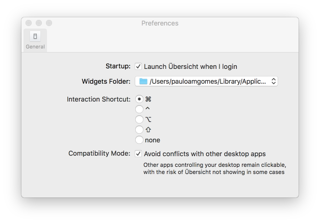

Übersicht-docker-containers
===========================

Docker widget for Übersicht

Docker Containers Übersicht Widget
==================================

A simple widget to use with Übersicht to show details about all running
containers. This is basically a wrapper for the "docker ps" command.

Get more widgets at [Übersicht](http://tracesof.net/uebersicht-widgets/)!

Example
-------

 

To enable, place the `dockercontainers.widget` folder in your
`Übersicht/widgets` directory.

 

Usage
-----

Just start your docker containers as usual, widget will update and display
details in the widget area.

To restart a container (or open a terminal shell) you need to have the
“Interaction Shortcut” enabled in the Übersicht preferences panel:

 
