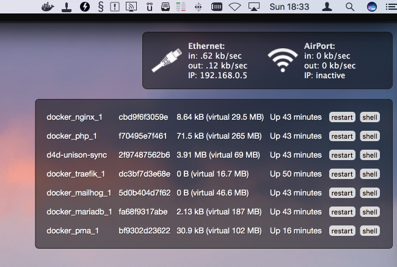

# Übersicht-docker-containers
Docker widget for Übersicht

# Docker Containers Übersicht Widget

A simple widget to use with Übersicht to show details about all running containers. This is basically a wrapper for the "docker ps" command.

Get more widgets at [Übersicht][1]!

## Example

To enable, place the `dockercontainers.widget` folder in your `Übersicht/widgets` directory.

[1]: http://tracesof.net/uebersicht-widgets/